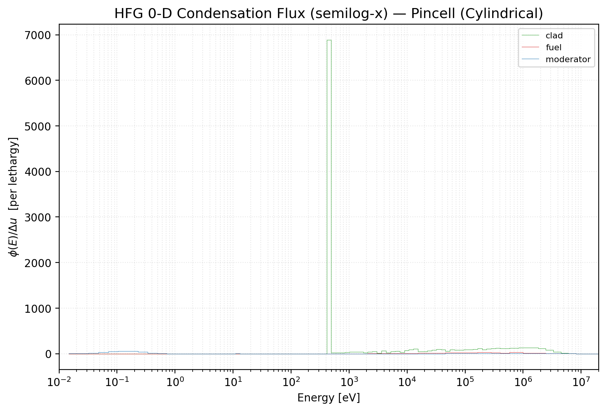
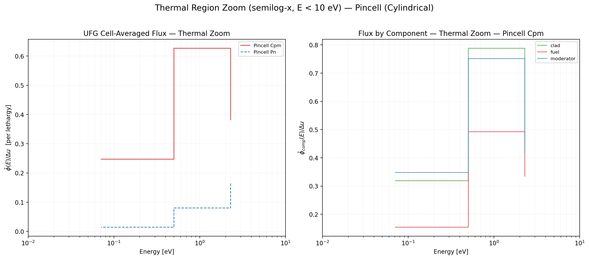
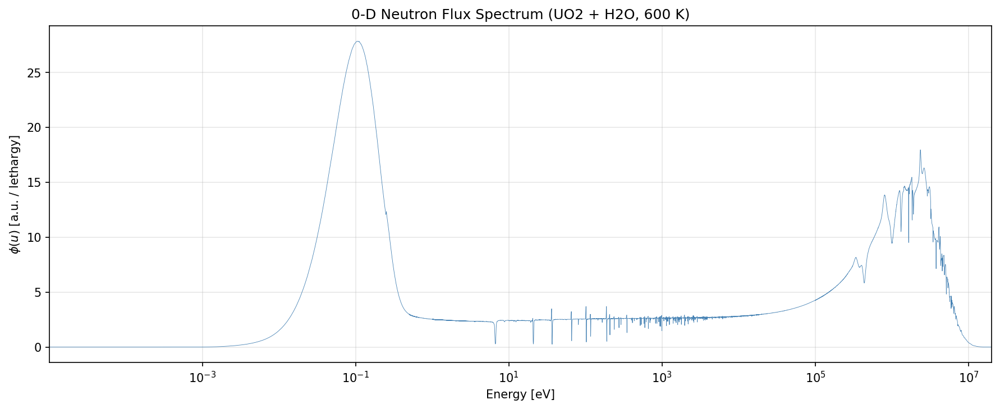
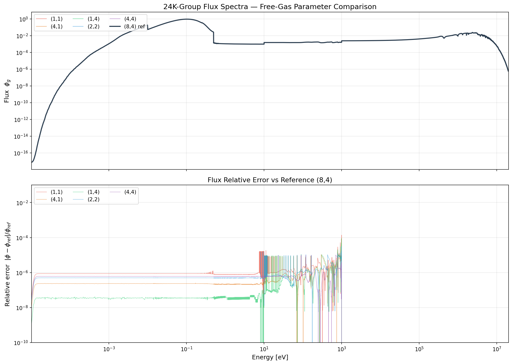
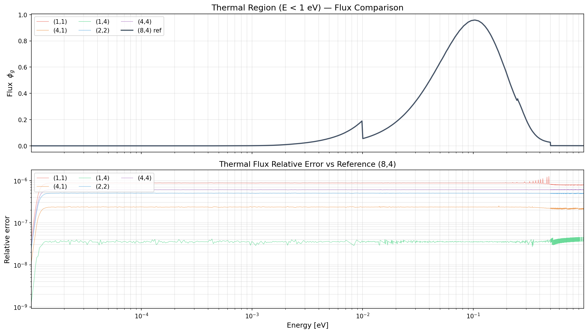

# Multi-level flux: HFG → UFG → MG

This demo visualises the multi-level condensation scheme on the same PWR pin-cell
problem: an HFG-resolution slowing-down flux solved in 0-D per composition, used
to collapse into a UFG library, which is then solved in 1-D transport and
optionally further collapsed to CASMO-70 MG.

See [theory/multilevel.md](../theory/multilevel.md) for the algorithm and
`docs/stage1_hfg_ufg_pipeline.md` for the full execution flow.

## HFG 0-D flux spectrum (fuel composition)


/// caption
Hyperfine-group (≈24,000 groups) 0-D flux for the fuel composition. The flux is
obtained by solving $(\Sigma_t - \Sigma_s)\phi = \chi$ with a Maxwellian-like
thermal tail and clean $1/E$ slowing-down. Resonance dips in the fuel are
directly resolved on the HFG grid. This flux is then used as the weighting
spectrum for HFG → UFG collapse.
///

## Thermal-region zoom


/// caption
Thermal region (below ≈1 eV). The S(α,β) kernel for hydrogen in water produces
a smooth Maxwellian peak around $kT \approx 0.05$ eV at the moderator temperature.
Up-scatter is fully resolved: the thermal equilibrium spectrum is an *output* of
the solver, not an imposed shape.
///

## 0-D homogeneous UO₂ + H₂O spectrum


/// caption
Independent 0-D calculation: homogenised UO₂ + H₂O at 600 K, 2,000 groups.
This is the smallest self-contained demonstration: a single `.i` file, one run
of `ufg_0d_app`, and you have a full-resolution slowing-down spectrum with
resonance absorption, S(α,β) thermal scattering, and Maxwellian equilibrium.
///

## Free-gas parameter study


/// caption
Sensitivity of the slowing-down + thermal flux to free-gas kernel parameters
(24,000 groups, $\sigma_b$ reference energy, source sub-sampling order).
Converged curves across different discretisations overlap closely — evidence
that the chosen defaults (8-pt source, 4-pt GL dest, 15 $kT$ window) are in
the converged regime. See [theory/thermal_scattering.md](../theory/thermal_scattering.md).
///


/// caption
Thermal-region zoom of the same parameter study. The Maxwellian peak position
and width are robust to the numerical-integration choices.
///

## Reproducing these figures

```bash
# HFG + UFG + MG pincell with Sn
./build/Release/ufg_1d_app examples/pwr_pincell_multilevel_sn.i \
                           --solver sn --sn-order 8 \
                           --output-dir output/pincell_multilevel_sn

# HFG + UFG + MG pincell with Pn
./build/Release/ufg_1d_app examples/pwr_pincell_multilevel_pn.i \
                           --solver pn --pn-order 3 \
                           --output-dir output/pincell_multilevel_pn

python scripts/plot_flux_spectra.py \
       output/pincell_multilevel_sn output/pincell_multilevel_pn \
       -o plots/multilevel.png

# 0-D UO2 + H2O
./build/Release/ufg_0d_app examples/uo2_mixed.i
python scripts/plot_0d_flux.py uo2_mixed_flux.csv
```

The plotting scripts and the normalisation protocol are covered in the
[running guide](../guide/running.md).
