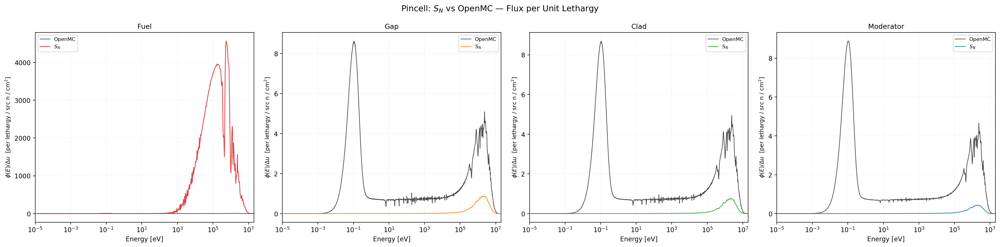
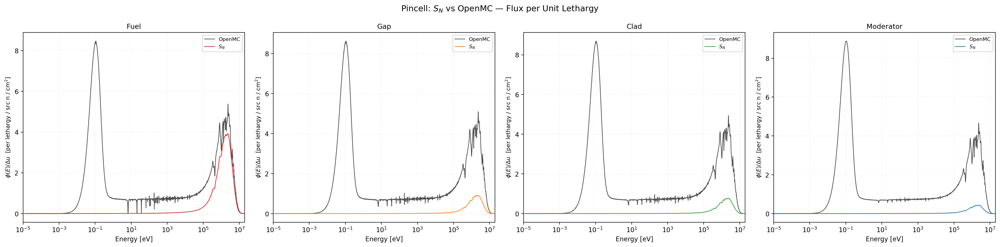
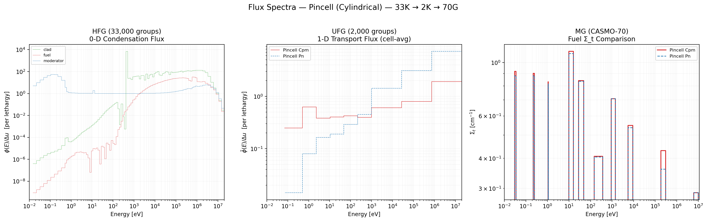
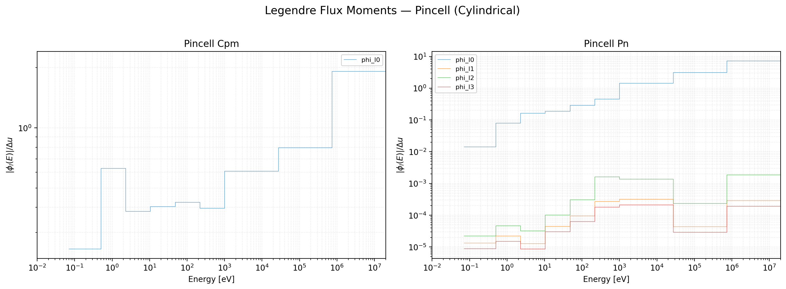
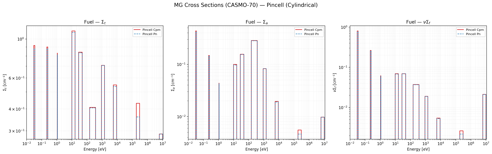

# Pin-cell verification against OpenMC

The PWR pin-cell benchmark is the primary verification case for the slab
solvers: a 17×17-style fuel pin (3.1 wt % UO₂), helium gap, Zircaloy-4
cladding, and H₂O moderator laid out as a 1-D slab of equivalent thicknesses.
UFG-Transport solves a 1-D fixed-source problem at UFG resolution and
compares against an OpenMC Monte-Carlo reference of an equivalent geometry.

## Geometry

Representative slab layout used in the verification runs (from
`examples/pwr_pincell_multilevel_sn.i`):

| Region | Material | Thickness (cm) | Cells |
|---|---|---|---|
| 0 | UO₂ (3.1 wt %) | 0.4096 | 20 |
| 1 | Helium | 0.0084 | 2 |
| 2 | Zircaloy-4 | 0.0570 | 5 |
| 3 | H₂O | 0.1550 | 15 |

Inner BC: reflective. Outer BC: white (Wigner–Seitz approximation of the
square lattice pitch 1.26 cm).

!!! note "Cylindrical geometry is not currently part of the verification set"

    Both the 1-D cylindrical $S_N$ solver and the cylindrical CPM solver are
    excluded from the verified-solver list — see the
    [status section](../index.md#status) for details. The slab $S_N$ / $P_N$
    pair is the trusted comparison path today.

## Slab Sn vs OpenMC


/// caption
Volume-averaged flux per unit lethargy in each slab region. Solid lines:
slab $S_2$ at UFG resolution. Dashed lines: OpenMC Monte-Carlo reference,
normalised by the single-constant rule described in
`docs/normalization_protocol.md`. Agreement is within a few percent across
all four regions.
///


/// caption
Effective cross section (flux-weighted fuel-zone average) vs energy. The UFG
library reproduces OpenMC's effective absorption behaviour in the large U-238
resonances (6.67 eV, 20.9 eV, 36.7 eV, …) without an explicit Bondarenko or
subgroup correction — the resonances are resolved directly by the HFG grid
and then flux-collapsed to UFG.
///

## Slab Sn vs slab Pn — cross-solver sanity check

The two verified solvers are cross-checked against each other on the same
problem:


/// caption
Scalar flux spectra in each region for the multi-level pin-cell: $S_8$ vs
$P_3$. The two solvers agree in the slowing-down and fast regions; small
discrepancies in the thermal tail reflect the different angular treatments
rather than a data or library issue.
///


/// caption
Legendre moments $\phi_1 / \phi_0$ in the $P_3$ solution, showing the
anisotropy level expected in a moderated system. The slab $S_N$ solver
reconstructs the same moment information from its quadrature over $\mu_n$.
///

## Collapsed MG library


/// caption
UFG → MG collapsed total macroscopic cross section on the CASMO-70 group
structure — the "output" library a downstream lattice code would consume.
///

## Running this case yourself

```bash
cd build/Release
./ufg_1d_app ../../examples/pwr_pincell_multilevel_sn.i \
             --solver sn --sn-order 8 \
             --output-dir ../../output/pincell_multilevel_sn

./ufg_1d_app ../../examples/pwr_pincell_multilevel_pn.i \
             --solver pn --pn-order 3 \
             --output-dir ../../output/pincell_multilevel_pn
```

Compare against OpenMC:

```bash
python scripts/compare_vs_openmc.py \
  output/pincell_multilevel_sn output/pincell_multilevel_pn \
  --openmc reference/openmc_pincell.h5
```

See the [running guide](../guide/running.md) for the complete CLI reference
and the mandatory normalisation protocol (`docs/normalization_protocol.md`).
