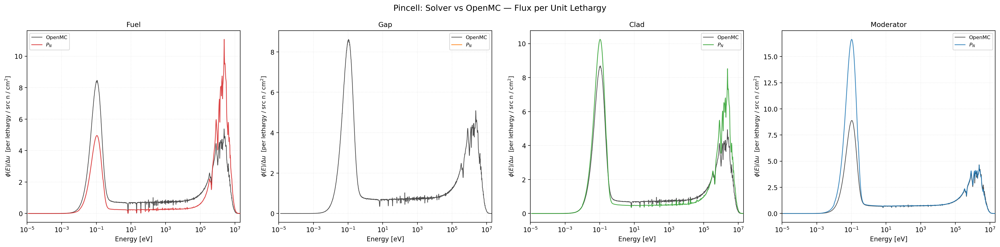
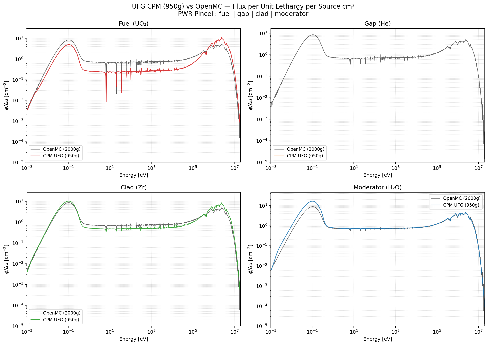

# Pin-cell verification against OpenMC

The PWR pin-cell benchmark is the primary verification case: a 17×17-style fuel
pin (3.1 wt% UO₂), helium gap, Zircaloy-4 cladding, and H₂O moderator in a
Wigner–Seitz equivalent cylinder. UFG-Transport solves the 1-D cylindrical
fixed-source problem at UFG resolution and compares against an OpenMC Monte-Carlo
reference of the same geometry.

Geometry (from `examples/pwr_pincell_multilevel_sn.i`):

| Ring | Material | Radial extent (cm) | Cells |
|---|---|---|---|
| 0 | UO₂ (3.1 wt%) | 0.0000 → 0.4096 | 20 |
| 1 | Helium | 0.4096 → 0.4180 | 2 |
| 2 | Zircaloy-4 | 0.4180 → 0.4750 | 5 |
| 3 | H₂O | 0.4750 → 0.6300 | 15 |

Inner BC: reflective (symmetry axis). Outer BC: white (Wigner–Seitz approximation
of the square lattice pitch 1.26 cm).

## CPM vs OpenMC


/// caption
Volume-averaged flux per unit lethargy in each of the four pin-cell regions.
Solid lines: UFG-Transport CPM at 2,000 groups. Dashed lines: OpenMC Monte-Carlo
reference, normalised by the single constant described in
`docs/normalization_protocol.md`.
///


/// caption
Same comparison on log–log axes. The slowing-down region (1 eV to 100 keV) shows
$1/E$ behaviour cleanly. Resonance absorption in the fuel (visible as the
orange-line notches near 6.7 eV, 20 eV, 36 eV) is captured by the UFG library
without an explicit self-shielding correction.
///

## Sn vs OpenMC


/// caption
Cylindrical $S_2$ solver flux vs OpenMC. $S_2$ is the cheapest meaningful
ordinate set; agreement is within a few percent across all four regions.
///


/// caption
Effective cross section (flux-weighted fuel-zone average) as a function of
energy. The UFG library reproduces OpenMC's effective absorption behaviour
in the large resonances without any Bondarenko or subgroup correction.
///

## CPM vs Pn (cross-solver sanity check)

To cross-validate the solvers themselves, the pin-cell problem is also solved
with slab $P_N$ on an equivalent slab geometry:


/// caption
Scalar flux spectra in each region: CPM (cylindrical) vs $P_3$ (slab-equivalent).
Agreement in the epithermal and fast regions is excellent; small discrepancies
in the thermal region reflect the genuine geometric difference between the
cylindrical Wigner–Seitz cell and its 1-D slab approximation, not a code bug.
///


/// caption
Legendre moments $\phi_1/\phi_0$ in the slab $P_3$ solution, showing the
anisotropy level expected in a moderated system.
///

## Collapsed MG library


/// caption
UFG → MG collapsed total macroscopic cross section on the CASMO-70 group
structure. This is the "output" library a downstream lattice code would consume.
///

## Running this case yourself

```bash
cd build/Release
./ufg_1d_app ../../examples/pwr_pincell_multilevel_sn.i \
             --solver sn --sn-order 8 \
             --output-dir ../../output/pincell_multilevel_sn

./ufg_1d_app ../../examples/pwr_pincell_multilevel_cpm.i \
             --solver cpm \
             --output-dir ../../output/pincell_multilevel_cpm
```

Then compare:

```bash
python scripts/compare_vs_openmc.py \
  output/pincell_multilevel_sn output/pincell_multilevel_cpm \
  --openmc reference/openmc_pincell.h5
```

See the [running guide](../guide/running.md) for the complete CLI reference.
